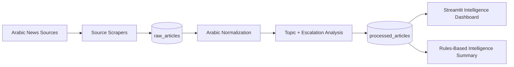

# Arabic Geopolitical OSINT Intelligence Platform

Production-style Arabic Open Source Intelligence (OSINT) platform for multi-source geopolitical news monitoring.

## Project Overview
This repository implements an end-to-end intelligence pipeline that ingests Arabic news, normalizes and analyzes text, stores raw + processed layers in PostgreSQL, and serves a Streamlit intelligence console for exploration and trend monitoring.
## Key Features
- Multi-source Arabic news scraping from Al Jazeera Arabic, BBC Arabic, and CNN Arabic
- Deduplicated ingestion pipeline using URL and content hashing
- Arabic text normalization for real-world noisy text
- Topic classification and escalation scoring for geopolitical monitoring
- Layered PostgreSQL/SQLite-compatible storage with `raw_articles` and `processed_articles`
- Interactive Streamlit dashboard with filters, KPIs, trend charts, and article exploration

## Why This Project Matters
- Demonstrates practical multilingual NLP under real-world text quality constraints.
- Shows data engineering maturity: ingestion, deduplication, processing layers, and analytics serving.
- Mirrors intelligence workflows used in geopolitical monitoring and early-warning analysis.
- Provides recruiter-visible evidence of product thinking, not just model experimentation.

## Architecture


### Pipeline Layers
1. **Ingestion layer**: Source-specific scrapers with retries, timeouts, polite delays, and selector isolation.
2. **Storage layer**: `raw_articles` + `processed_articles` tables with dedupe logic on URL/content hash.
3. **Processing layer**: Arabic normalization, keyword topic classifier, escalation scoring, country guess heuristic.
4. **ML upgrade path**: TF-IDF + Logistic Regression scaffold with training/evaluation utilities.
5. **Presentation layer**: Streamlit dashboard with filters, KPIs, trend charts, and briefing summaries.

## Tech Stack
- **Language**: Python 3.11
- **Scraping**: `requests`, `beautifulsoup4`
- **NLP/ML**: custom Arabic normalization, `scikit-learn` (TF-IDF + Logistic Regression)
- **Data/ORM**: PostgreSQL, SQLAlchemy
- **Analytics UI**: Streamlit + Plotly
- **Testing**: pytest
- **Containerization**: Docker + Docker Compose

## Folder Structure
```text
arabic_osint_platform/
├── data/
│   ├── raw/
│   └── processed/
├── notebooks/
│   └── exploration.ipynb
├── sql/
│   └── init_schema.sql
├── src/
│   ├── config/
│   ├── scraping/
│   ├── processing/
│   ├── database/
│   ├── pipeline/
│   ├── dashboard/
│   └── utils/
├── tests/
├── .env.example
├── .gitignore
├── docker-compose.yml
├── Dockerfile
├── requirements.txt
├── README.md
└── main.py
```

## Quick Start
```bash
git clone <https://github.com/VenommCS/arabic-osint-intelligence-platform.git>
cd arabic_osint_platform
python3 -m venv .venv
source .venv/bin/activate
pip install -r requirements.txt
export DATABASE_URL=sqlite:///data/osint_demo.db
python3 main.py init-db
python3 main.py ingest
python3 main.py process
python3 main.py dashboard
```

## Setup Instructions
### 1. Clone and enter project
```bash
git clone <https://github.com/VenommCS/arabic-osint-intelligence-platform>
cd arabic_osint_platform
```

### 2. Create local environment
```bash
python3 -m venv .venv
source .venv/bin/activate
pip install -r requirements.txt
```

### 3. Configure environment
```bash
cp .env.example .env
# edit .env if needed
```

### 4. Start PostgreSQL (Docker)
```bash
docker compose up -d postgres
```

### 5. Initialize schema and run pipeline
```bash
python main.py init-db
python main.py ingest
python main.py process
```

### 6. Launch dashboard
```bash
python main.py dashboard
```
Open: `http://localhost:8501`

## How To Run Fully in Docker
```bash
docker compose up --build
```

## Example Workflow
1. Ingestion pulls recent articles from Al Jazeera Arabic, BBC Arabic, and CNN Arabic.
2. Raw articles are deduplicated and stored with metadata and hashes.
3. Processing normalizes Arabic text and generates topic + escalation labels.
4. Dashboard surfaces trends, source patterns, and weekly intelligence brief.

## Example Screenshots (Placeholders)
- `docs/screenshots/overview.png`
- `docs/screenshots/explorer.png`
- `docs/screenshots/trends.png`
- `docs/screenshots/intelligence_summary.png`

## Testing
```bash
pytest -q
```

## Selector Maintenance Notes
Scraper selectors are intentionally isolated in:
- `src/scraping/aljazeera_scraper.py`
- `src/scraping/bbc_arabic_scraper.py`
- `src/scraping/cnn_arabic_scraper.py`

If source HTML changes, only update `extract_article_links()` and `parse_article()` in those files.

## Future Improvements
- Airflow-based scheduling and data quality checks.
- AraBERT/transformer classifier replacing TF-IDF baseline.
- Vector search for semantic incident retrieval.
- FastAPI service layer for programmatic access.
- Cloud deployment (Render/Railway) with managed Postgres.
- Human-in-the-loop analyst feedback for improved label quality.

## Resume-Ready Bullet Points
- Built a production-style Arabic OSINT pipeline ingesting multi-source geopolitical news into PostgreSQL with deduplication and layered data modeling.
- Implemented Arabic NLP normalization and explainable topic/escalation classification to support intelligence-style monitoring.
- Designed and shipped an interactive Streamlit + Plotly intelligence console with filtering, trend analytics, and automated weekly briefing summaries.
- Structured codebase using modular pipeline architecture, ORM-based persistence, Dockerized local deployment, and pytest-backed validation.

## Important Assumptions
- Public site layouts may change; parser selectors include TODO markers where manual updates may be required.
- Baseline classifier is rule-based for explainability; ML scaffold is provided for labeled-data upgrades.
- Escalation scoring is lexical and intended as an initial prioritization signal, not final analyst judgment.
